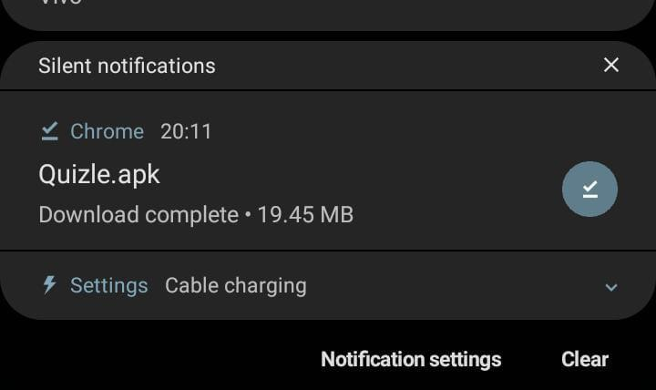
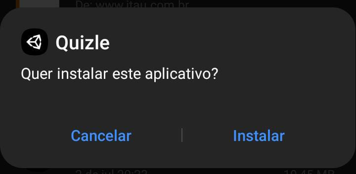
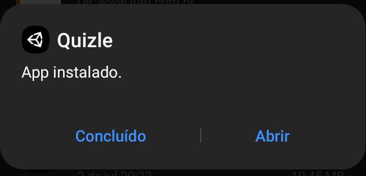
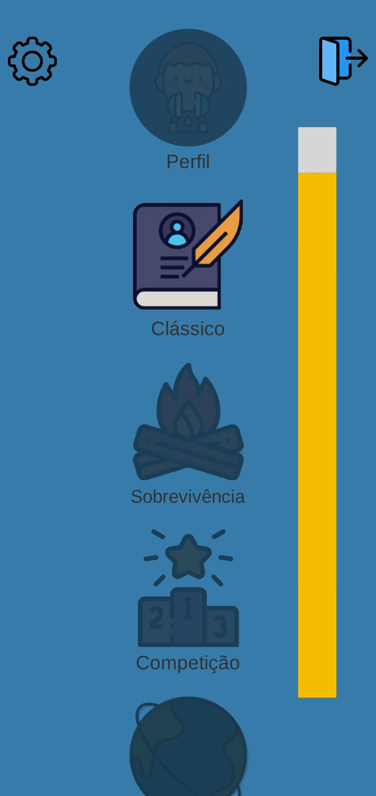

# Quizle
 Repositório para o desenvolvimento do jogo quizle.

## Tecnologias utilizadas

* **Unity**: Versão 2021.1.3f1

## Tutorial de instalação
1.  Descompacte o arquivo “Quizle.zip” e clique no quizle.apk para realizar o download do jogo. Caso suceda, vá para o item 4.
2.  Baixe o aplicativo no Android, clicando no link: [https://github.com/diversao-seria/quiz-unity/releases/tag/1.02](https://github.com/diversao-seria/quiz-unity/releases/tag/1.02)
3.  No github, clique em “Assets” e depois em “Quizle.apk”, como mostram as figuras abaixo:

 

4. Após o download da apk, o seu dispositivo deve exibir uma notificação parecida com esta:

5. Ao clicar na notificação, o seu dispositivo deve exibir uma mensagem perguntando se você deseja instalar o aplicativo, como mostrado na imagem a seguir. Clique em “Instalar”.

6. Concluída a instalação, o seu dispositivo deve exibir uma mensagem (de App instalado) parecida com a figura abaixo. Então, basta clicar em “Abrir” para iniciar o aplicativo.

7.  Ao tocar em “Clássico”, o jogo exibirá uma mensagem pedindo autorização para utilizar o seu microfone, um requisito para a ferramenta de acessibilidade “text-to-speech”, que permite ao aplicativo ler o texto da tela em voz alta. Clique em “Permitir” e o jogo estará pronto para ser jogado.

 
